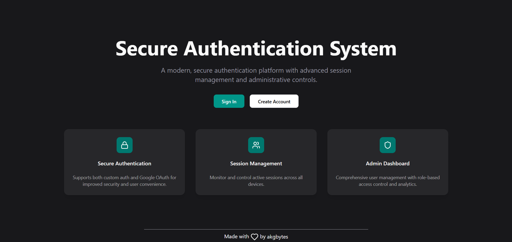

<h1 align="center">SecureAuth</h1>

<div align="center">

[](https://x.com/akgbytes) &nbsp;
[](https://www.linkedin.com/in/akgbytes/) &nbsp;
[](mailto:akgbytes@gmail.com) &nbsp;
[](https://conventionalcommits.org) &nbsp;
[](./LICENSE)

</div>

<div align="center">
  
</div>

## 🚀 Introduction

**SecureAuth** is a modern **full-stack authentication system** designed with security and scalability in mind.  
It includes everything you need to handle **user login, registration, email verification, password resets, RBAC, and session management**, all built using today’s best practices.

## ✨ Features

- 🔑 **JWT Authentication**: Short-lived access tokens with refresh token rotation
- 📧 **Email Verification**: Magic link account verification & resends
- 🔒 **Password Reset Flow**: Secure expiring tokens for password recovery
- 👥 **Role-Based Access Control (RBAC)**: Admin/user separation
- 🖼 **Avatar Uploads**: Multer + Cloudinary integration
- 🗂 **Session Management**: Track and revoke active sessions
- 🛡 **Validation with Zod**: Type-safe request/response schemas
- 📦 **Reusable UI Components**: Powered by Shadcn UI + Tailwind CSS
- 📝 **Structured Logging**: With Winston & daily rotate files

---

## 🛠 Tech Stack

### Frontend

- [React](https://react.dev/) + [TypeScript](https://www.typescriptlang.org/)
- [Tailwind CSS](https://tailwindcss.com/) + [Shadcn UI](https://ui.shadcn.com/)
- [React Hook Form](https://react-hook-form.com/) + [Zod](https://zod.dev/)

### Backend

- [Node.js](https://nodejs.org/) + [Express.js](https://expressjs.com/)
- [Postgres](https://www.postgresql.org/) (via [Neon](https://neon.tech/))
  [Drizzle ORM](https://orm.drizzle.team/)
- [Mailtrap](https://mailtrap.io/) for testing emails
- [Jose](https://github.com/panva/jose) for JWT handling
- [Cloudinary](https://cloudinary.com/) for image storage

## ⚡️Getting Started

### Prerequisites

Ensure you have installed:

- [Git](https://git-scm.com/)
- [Node.js](https://nodejs.org/)

### 1. Clone the repository

```bash
git clone https://github.com/akgbytes/secure-auth.git
cd secure-auth
```

### 2. Install dependencies

```bash
cd server && pnpm install
cd ../web && pnpm install
```

### 3. Set up environment variables

Copy the sample .env file and fill in your credentials:

```bash
cp .env.sample .env
```

### 4. Database Setup

```bash
cd server
pnpm db:push
```

### 5. Run the app

```bash
cd web && pnpm dev
cd ../server && pnpm dev
```

## 🤝 Contributing

Contributions, issues, and feature requests are welcome!
Feel free to open an issue or submit a PR.

## 📜 License

SecureAuth is licensed under the MIT License.
Use it freely and build something awesome.
