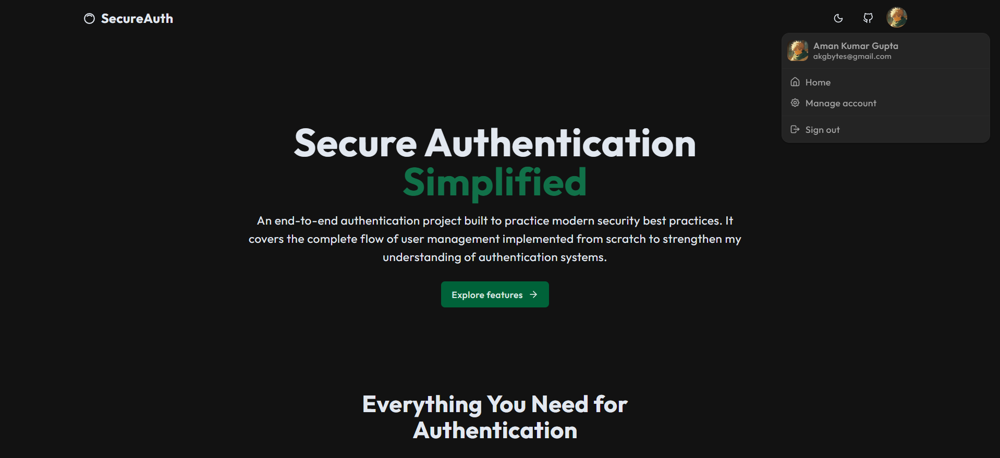
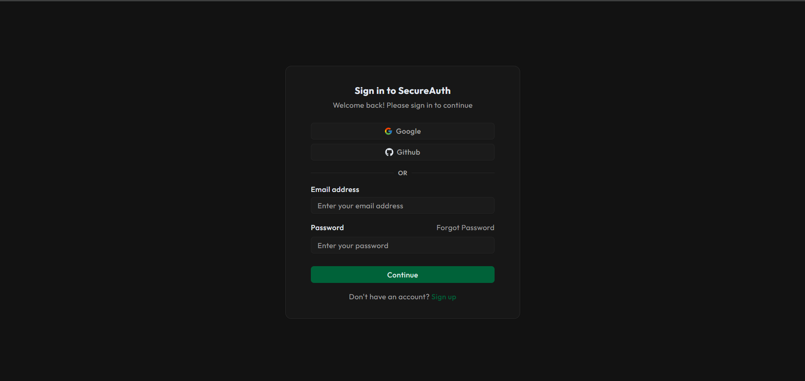

<h1 align="center">SecureAuth</h1>

<div align="center">

[](https://x.com/akgbytes) &nbsp;
[](https://www.linkedin.com/in/akgbytes/) &nbsp;
[](mailto:akgbytes@gmail.com) &nbsp;
[](https://conventionalcommits.org) &nbsp;
[](./LICENSE)

</div>

<div align="center">
  
  
</div>

## Overview

**SecureAuth** is a simple and complete authentication system with login, registration, email verification, password reset, sessions, and role-based access.

## Features

- **JWT Authentication**: Short-lived access tokens with refresh token rotation
- **Email Verification**: Magic link account verification & resends
- **Password Reset Flow**: Secure expiring tokens for password recovery
- **Role-Based Access Control (RBAC)**: Admin/user separation
- **Avatar Uploads**: Multer + Cloudinary integration
- **Session Management**: Track and revoke active sessions
- **Validation with Zod**: Type-safe request/response schemas
- **Reusable UI Components**: Powered by Shadcn UI + Tailwind CSS
- **Structured Logging**: With Winston & daily rotate files


## Tech Stack

### Frontend
[](https://react.dev/)
[](https://www.typescriptlang.org/)
[](https://vitejs.dev/)
[](https://tailwindcss.com/)
[](https://ui.shadcn.com/)
[](https://react-hook-form.com/)
[](https://zod.dev/)
[](https://tanstack.com/query/latest)
[](https://tanstack.com/router/latest)
[](https://github.com/pmndrs/zustand)

### Backend
[](https://nodejs.org/)
[](https://expressjs.com/)
[](https://www.postgresql.org/)
[](https://orm.drizzle.team/)
[](https://neon.tech/)
[](https://mailtrap.io/)
[](https://cloudinary.com/)
[](https://zod.dev/)
[](https://github.com/winstonjs/winston)


## Getting Started

### Prerequisites

Ensure you have installed:

- [Git](https://git-scm.com/)
- [Node.js](https://nodejs.org/)

### 1. Clone the repository

```bash
git clone https://github.com/akgbytes/secure-auth.git
cd secure-auth
```

### 2. Install dependencies

```bash
cd server && pnpm install
cd ../web && pnpm install
```

### 3. Set up environment variables

Copy the sample .env file and fill in your credentials:

```bash
cp .env.sample .env
```

### 4. Database Setup

```bash
cd server
pnpm db:push
```

### 5. Run the app

```bash
cd web && pnpm dev
cd ../server && pnpm dev
```

## Contributing

Contributions, issues, and feature requests are welcome!
Feel free to open an issue or submit a PR.

## License

SecureAuth is licensed under the MIT License.
Use it freely and build something awesome.
