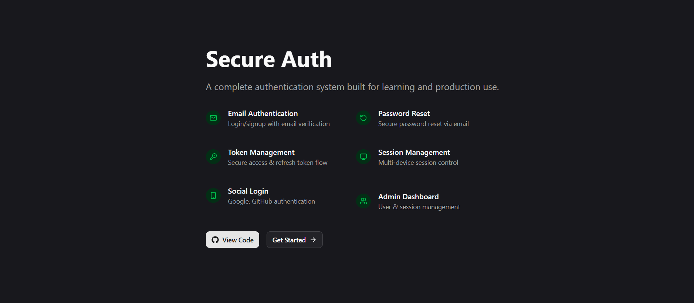

<h1 align="center">SecureAuth</h1>

<div align= "center">

[](https://x.com/akgbytes) &nbsp;
[](https://www.linkedin.com/in/akgbytes/) &nbsp;
[](mailto:akgbytes@gmail.com)&nbsp;
[](https://conventionalcommits.org)&nbsp;
[](https://choosealicense.com/licenses/mit/)

</div>

<div align="center">  </div>

</div>

<br>

## Introduction

SecureAuth is a powerful authentication system built with React, Redux Toolkit, RTK Query, Node.js, Prisma, and PostgreSQL, it includes complete flows for login, signup, email verification, password resets, image uploads, and RBAC.
<br>

## Features

- User Registration & Secure Login

- JWT Access & Refresh Tokens with Auto-Refresh

- Email Verification via OTP

- Forgot Password Flow with Expiring Token

- Role-Based Access Control (RBAC)

- Organized File and Folder Structure

- Avatar Upload with Multer + Cloudinary

- RTK Query for API Caching & Error Handling

- Reusable Components with Shadcn UI & Tailwind

- Schema Validation using Zod

- Clean Architecture & Structured Logging

<br>

## Tech Stack

### Frontend

- [React](https://react.dev/)

- [Redux Toolkit + RTK Query](https://redux-toolkit.js.org/)

- [Tailwind CSS](https://tailwindcss.com/)

- [TypeScript](https://www.typescriptlang.org/)

- [Shadcn UI](https://ui.shadcn.com/)

### Backend

- [Node.js](https://nodejs.org/)

- [Express.js](https://expressjs.com/)

- [Zod](https://zod.dev/)

- [Prisma](https://www.prisma.io)

- [Postgres](https://neon.tech/)

- [Mailtrap](https://mailtrap.io/)

<br>

## Local Development

0.  **Prerequisites** <br>
    Make sure you have the following installed on your machine:

    - [Git](https://git-scm.com/)
    - [Node.js](https://nodejs.org/en)

1.  **Clone the repository:**

    ```bash
    git clone https://github.com/akgbytes/secure-auth.git
    ```

2.  **Navigate to the project directory:**

    ```bash
    cd secure-auth
    ```

3.  **Install dependencies:**

    ```bash
    cd backend && npm install
    cd ../frontend && npm install
    ```

4.  **Add Environment Variables:**

    Create `.env` file in the root folder and copy paste the content of `.env.sample`

    ```bash
    cp .env.sample .env
    ```

    Update credentials in `.env` with your credentials.

5.  **Setup Database**

    ```bash
    cd backend
    npx prisma migrate dev --name init
    ```

6.  **Start the App:**

    ```bash
    cd frontend && npm run dev
    cd ../backend && npm run dev
    ```

    Visit &nbsp;[http://localhost:5173](http://localhost:5173)&nbsp; to access your app.

<br>

## Contributing

Contributions are more than welcome! Feel free to open issues or submit pull requests.

## License

SecureAuth is open-sourced under the [MIT License](./LICENSE). Use it freely and share what you build!
